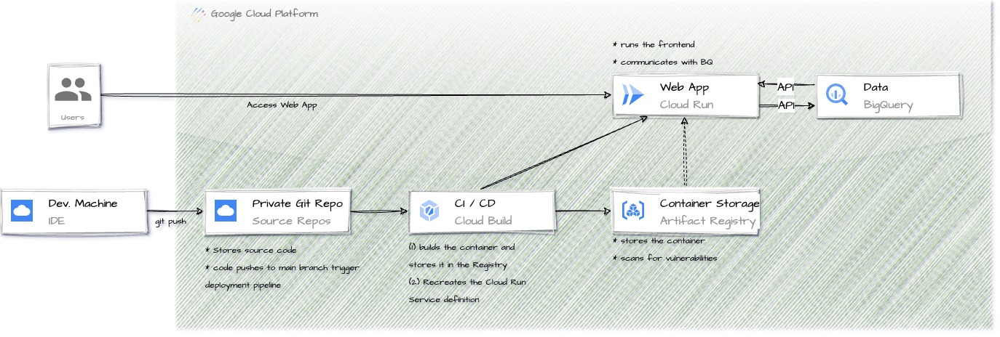

# placeholders-run-bigquery
placeholders-run-bigquery is a pre-built barebones web application that's integrated with BigQuery.  It's sole purpose is to provide a working example of a real life application that would use external APIs (this application uses the icanhazdadjoke API as an external data provider) as well as internal GCP services (such as BigQuery) to deliver a specific capability.  

- placeholders-run-bigquery dynamically fetches Dad Jokes from the icanhazdadjoke API and then generates a random number to make it easy for users to submit.  You can override the joke with your own text and watch the reactive updates (ooh so exciting ... :-/)

- There is a query area under the "submit" button; when the query is ran, all of the current data in the existing BigQuery table presented as a table in the web app.  (my formatting | such wow )

## Architecture
The source in this repo represents the top line in the diagram below:  Cloud Run + BigQuery - the actual "core" of the running application.  How the source is converted from "source" into a containerized web application is represented by the bottom portion of the architecture.  



The 'core' infrastructure consists of:
- Cloud Run:  Cloud Run provides serverless compute for the container.  It's what run's the actual container when an invocation is made via HTTP(S).  This scales to zero when requests aren't coming.
- BigQuery:  BigQuery is the 'data' layer of the application. This is responsible for storing inserts and for providing data at query time.  

## How does it work?
This application uses various technologies and techniques to deliver a secure and performant user experience.

- The application's frontend is built with SolidJS which is lightweight and easy to use.  Instead of hosting the site using the default server (Vite), we compile the application to HTML / JS / and CSS and then supply the static files to a traditional web application server like nginx.  The compilation (building) of the web app into static files happens within a building container which is disposed of as part of a multi-stage build.

- API requests, such as those sent to BigQuery, are not sent directly from the web application since we're compiling to static files.  Instead, requests are handled via a locally running proxy which is responsible for authenticating and then issuing requests to the actual backends.  The authenticating principal is the listed Service Account on the Cloud Run service.  The "proxy" behavior is managed by Vite's "proxy" settings during testing and development; during production it's Nginx responsibility to forward traffic destined from `/insert` and `/query` to the appropriate backend.  

- As mentioned before, the web app itself runs on Nginx, a web server.  The static files from the build step are provided into nginx's default static file hosting directory (`/usr/share/nginx/html`).  This may be sufficient for your security needs and policies; check with central IT for further governance.  A snippet of the nginx.conf is provided for ease-of-review:

```
server {
    listen       8080;
    server_name  localhost;


    location / {
        root   /usr/share/nginx/html;
        index  index.html index.htm;
    }

    # redirect server error pages to the static page /50x.html
    #
    error_page   500 502 503 504  /50x.html;
    location = /50x.html {
        root   /usr/share/nginx/html;
    }

    # Proxying API requests to the backend.    
    location /insert {
       proxy_pass   http://127.0.0.1:9080;
    }
    location /query {
        proxy_pass   http://127.0.0.1:9080;
    }

}
```

## Setup
- BigQuery:  Visit BigQuery and create a Dataset (or reuse an existing one) and then create a table using DDL statement below.  Make sure to do this from the same project that'll host your Cloud Run Service:

```sql
-- replace DATASET_ID with your datasetID and TABLE_ID with your tableID
CREATE OR REPLACE TABLE DATASET_ID.TABLE_ID (
  message STRING,
  number STRING
)
```

- IAM.  Visit IAM & Admin > Service Accounts and create a new service account that your Cloud Run Service will use.  Grant that service account `roles/bigquery.dataEditor`. If, by chance, you forget to do that last step, you can use IAM & Admin > IAM > Grant Access dialogue where you'll supply the service account as the principal and then add `roles/bigquery.dataEditor`.  

Yeah, that happens to everyone, especially if your rushing.  

## Deployment

Deployment is now entirely managed by Cloud Build.  

Before invoking the following command, review the bottom of `cloudbuild.yaml` where the substitution variables are defined and update to match your particular environment.  Note that $PROJECT_ID does not require an update; this variable is injected for you by the Cloud Build service.  

```yaml
substitutions:
  # _SERVICE: Cloud Run Service name
  _SERVICE: my-cloud-run-services-name
  # _REGION: Cloud Run Service region
  _REGION: us-central1
  # _REPO_REGION: Artifact Registry Container Registry Region
  _REPO_REGION: us
  # _REPO: Artifact Registry Container Registry Name
  _REPO: containers
  # _DATASET_ID: BigQuery DatasetID
  _DATASET_ID: my-bigquery-dataset-id
  # _TABLE_ID: BigQuery TableID
  _TABLE_ID: my-bigquery-table-id
  # _SERVICE_ACCOUNT: Cloud Run Service Service Account.  Supply this at build time via substitutions or
  # replace the ~ with your service account.  
  _SERVICE_ACCOUNT: ~
```

The invoking principal [user, developer, admin, etc.] must supply the Cloud Run service's service account via the --substitusions flag or the build will fail UNLESS the _SERVICE_ACCOUNT placeholder (~) is replaced with the desired service account.  

```shell
gcloud builds submit --substitutions _SERVICE_ACCOUNT=ye-olde-svc-acct@iam.gserviceaccount.com
```


## About

Building and deploying the application is done with Cloud Build (CB), GCP's serverless CI / CD solution.  CB is mix of containers, linux scripting, and Google magic that's fun and easy use.  

Cloud Build combines linux scripting with containers so that you can define and pipeline build stage artifacts into deployable assets.  Cloud Build pipelines are defined in yaml and built in 'steps' which can run in parallel.  Files can be excluded from the build submission with a `.gcloudignore` file which works identically to other .*ignore files such as .gitignore and .dockerignore.  

From the root directoy, the pipeline is invoked at the CLI with `gcloud builds submit` command family (see Deployment for details). 

This is a very simple two step pipeline: build and then deploy.
- Step 1 (`docker-build-push-placeholders-run-bigquery`) is responsible for building the application container and then pushing it to the Artifact Registry where the container will actually 'live'. To streamline deployments in other environments, a .env file is dynamically generated based on the supplied substitution variables (please see `cloudbuild.yaml` for details).  This .env file is converted to strings during the frontends build stage.  


- Step 2 (`gcloud-run-deploy-placeholders-run-bigquery`) is resopnsible for deploying the actual container itself to Cloud Run.  This container uses a gcloud base image to run gcloud commands in an ephemeral container responsible for the actual deployment fo the container. It is also 100% linux scripting.  Environment variables are set at the Cloud Run Service to allow for management at the service level (as opposed to the Docker container level)

Extra steps can be added that are responsible for SAST and DAST and other common CI/CD techniques and technologies.  

## Caveats 
- This is not a "wow" factor application; it is bare bones on purpose - the goal of this application is to serve as scaffolding; as a blueprint to build upon towards defining an repeatable, enterprise solution for deploying applications on Cloud Run. 
- This application expects a manual invocation of the Cloud Build pipeline to deploy itself.  Cloud Build is normally integrated with source control so that when a commit to the main branch is made and approved, Cloud Build kicks in and deploys a new version of the application.  
- I used SolidJS; developers and practitioners are welcome to use whatever framework they're most comfortable with:  React / Preact / Lit / Vue / etc. - the framework doesn't matter.  
- I used Nginx here as the configuration files are very easy to follow along with and modify.  Users are welcome to use Apache or any other web server (including custom ones!).  And if you want to be super fancy, you're also welcome to use Varnish as a caching layer and Nginx in front of it.
  - You don't need to worry about configuring Nginx as an SSL terminator; the Cloud Run service itself is responsible for managing certificates for you (IE Cloud Run terminates SSL for you!).  If you really want to manage certificates, you can put the Clodu Run service itself behind a load balancer and manage those SSL policies as per your requirements!


## TIL: Today I learned.
- The Cloud Run service's service account will not work with roles/bigquery.user;  roles/bigquery.dataEditor at the PROJECT level is the appropriate resource